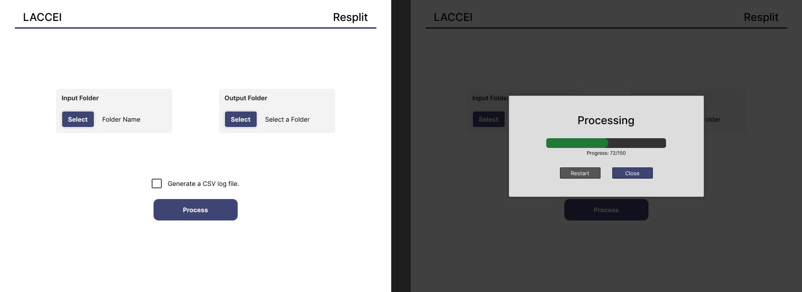

# GUI Mockup
The proposed graphical user interface (GUI) for this app is simple. The design implements a simple interface to the core functionalities of the application. There will be select buttons for the input and output folders and a checkmark asking if it should create a CSV log file. After all the needed settings are complete, the process button at the bottom of the page should enable. Clicking it will trigger the main processing program and show a progress bar (in addition to a status below it showing how many files it has completed). Two options (to close or to restart the process) will appear upon completion.

The figure below shows the two central states of the GUI. The left side presents the options and configurations needed for the program and its initial state (the process button should be disabled until the input and output folders are selected). The right side shows the progress window that should appear when clicking the process button. The restart and close buttons shouldn't appear until the program processes all the files.

<figure>
    
    <figcaption style="text-align: center;">Initial state of the program on the left. Progress and completion on the right.</figcaption>
</figure>

The GUI doesn't have to be exactly 800x600. Decreasing the size could also reduce the white space, but it is up to the developer. Using the same colors as the mockup is encouraged but not required.