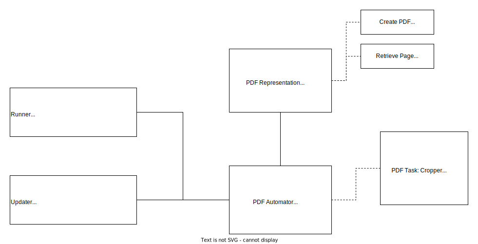
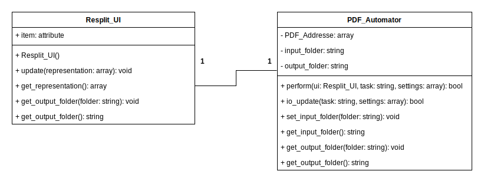

# Architecture Overview
As Resplit is a simple application for completing a single task, its internal architecture is also simple. Its architectural pattern is model-view-controller but all in a single file. It is flexible enough to add other types of tasks (not only splitting PDFs) in the model space. Yet, it would require significant changes in the controller and view spaces (the GUI specifically).

The important (and still simple) part is the PDF Automator, which performs the instructed task in a batch of given files. The PDF Representation, although designed here, is substituted by objects from the [PyPDF](https://pypi.org/project/pypdf/) library.

For the graphical interface, the application uses tkinter. Despite the conceptual design showing the front end as two separate modules, the Updater and the Runner, the actual implementation has a single object taking care of the front end.

The class taking care of the front end is Resplit_UI, while PDF_Automator takes care of the batch tasks. These two are tightly coupled; this is why a change in the tasks that the application could perform require a substantial change of the Resplit_UI

Finally, we will use [PyInstaller](https://pypi.org/project/pyinstaller/) to make it easy for the team to download and use the application without needing a setup.